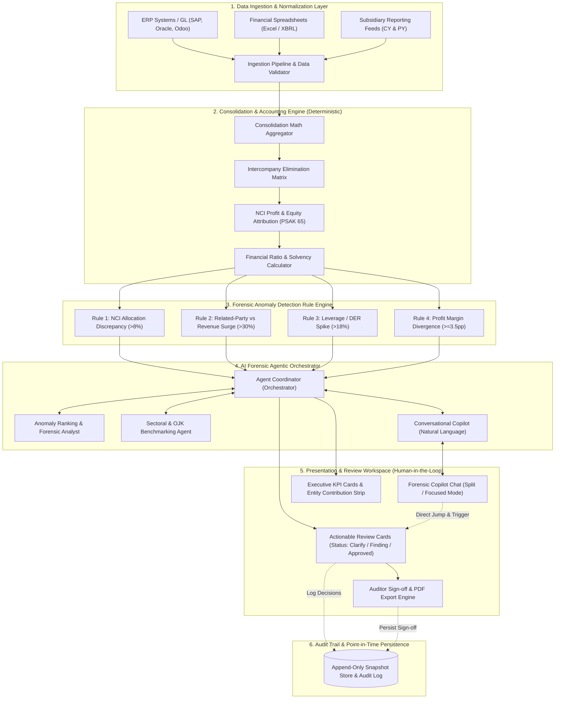
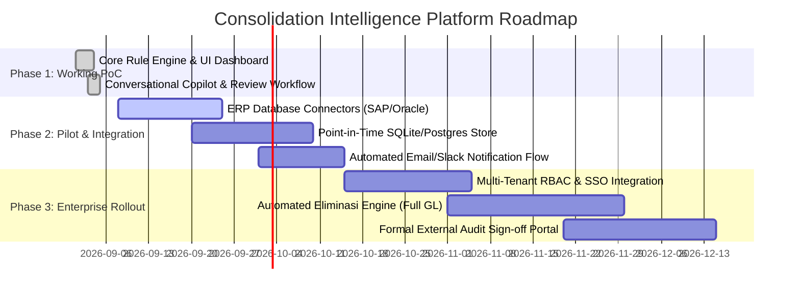

# Solution Architecture: AI-Powered Consolidation Analyzer & Review Workspace

**Project**: Konsolidasi Analyzer — Working PoC to Enterprise Architecture  
**Target Entity**: Yayasan (Holding Induk) & 5 Anak Perusahaan (PT Anak I – V)  
**Document Version**: 1.0 (Production Roadmap)  
**Author**: Antigravity Solutions & Forensic Accounting Advisory  
**Status**: Approved for Executive Presentation  

---

## 1. Executive Summary & Business Context

Organizations operating multi-tier holding structures—specifically foundations (*Yayasan*) controlling diversified commercial subsidiaries (*PT Anak*) with varying Non-Controlling Interest (NCI) shares—face severe operational and compliance bottlenecks during quarterly and annual financial consolidations:

1. **Delayed Anomaly Detection**: Manual review spreadsheets delay detection of material mismatches until late in the external audit cycle.
2. **NCI Allocation Leakages (PSAK 65 / IFRS 10)**: Misallocations between parent net income and minority shareholders distort reported holding performance.
3. **Unmonitored Related-Party Debt (PSAK 7 / IAS 24)**: Rapid intercompany receivable spikes drain subsidiary liquidity into affiliates without explicit holding oversight.
4. **Lack of Human-in-the-Loop Audit Trails**: Traditional BI tools provide read-only charts but lack contextual reasoning, explanation rationales, and tracked decision workflows for internal auditors.

**The Solution**: A hybrid financial intelligence platform combining a **deterministic accounting rule engine** with a **conversational AI forensic agent** and an **interactive Review Workspace** ("Hasil yang Perlu Di-Review") that allows holding executives and auditors to review, query, clarify, and sign off consolidation workpapers in real time.

---

## 2. End-to-End Solution Architecture

---

## 3. Component Architecture & Deep-Dive

### 3.1. Layer 1: Data Ingestion & Pre-Processing
- **Multi-Entity Standardization**: Normalizes trial balances across the 6 entities (`Yayasan` holding + `PT Anak I` through `PT Anak V`).
- **Data Integrity Boundaries**:
  - Current Year (CY) and Prior Year (PY) validation.
  - Verification of non-negative revenue, assets, and liabilities.
  - Rejection of synthetic "zero" placeholders; missing data is surfaced as `null` with explicit audit warnings.

### 3.2. Layer 2: Deterministic Financial Consolidation Engine
- **Consolidated Aggregation**:
  $$\text{Consolidated Revenue} = \sum_{i=1}^{n} \text{RevCY}_i - \text{Intercompany Eliminasi}$$
- **NCI Profit Sharing (PSAK 65)**:
  $$\text{NCI Profit Share} = \sum_{e \in \text{NCI Entities}} \text{NetIncomeCY}_e \times \left(\frac{\text{NCI}_e}{100}\right)$$
  $$\text{Net Income to Parent} = \text{Consolidated Net Income} - \text{NCI Profit Share}$$
- **Solvency & Solvability Ratios**:
  $$\text{Consolidated DER} = \frac{\sum \text{Liabilities}}{\sum \text{Equity}}$$
  $$\text{Consolidated ROA} = \frac{\text{Consolidated Net Income}}{\sum \text{Assets}}$$
  $$\text{Parent ROE} = \frac{\text{Net Income to Parent}}{\text{Parent Equity Share}}$$

### 3.3. Layer 3: Forensic Rule Engine
The engine evaluates 5 deterministic anomaly vectors:
1. **NCI Allocation Mismatch**: Flags if $|\text{Reported NCI} - \text{Computed NCI}| / \text{Computed NCI} > 8\%$.
2. **Related-Party Debt Spikes**: Flags if $\Delta \text{RP Receivables YoY} - \Delta \text{Revenue YoY} > 30\%$.
3. **Leverage Escalation**: Flags if $\text{DER CY} / \text{DER PY} - 1 > 18\%$.
4. **Margin Distortion**: Flags if $|\text{Net Margin CY} - \text{Net Margin PY}| \ge 3.5\text{ percentage points}$.
5. **Earnings Quality Divergence**: Flags when Revenue grows $> 2\%$ while Net Income declines YoY.

### 3.4. Layer 4: AI Agent Orchestrator (Multi-Agent System)
- **Forensic Reasoning Agent**: Translates quantitative deviations into auditor-level rationales, referencing regulatory implications (e.g. understatement of parent income, hidden dividend extraction).
- **Sectoral Benchmark Agent**: Contextualizes company performance against POJK standards (e.g. maximum DER of 5.0x for financial institutions) and industry peers.
- **Conversational Copilot**: Handles free-form natural language queries from leadership, provides one-click action pills, and drives user navigation directly to affected review items.

### 3.5. Layer 5: Review Workspace & Human-in-the-Loop (HITL)
- **Review Decision Lifecycle**:
  - `⏳ Belum Di-review`: Initial state upon anomaly detection.
  - `❓ Perlu Klarifikasi`: Sends automated inquiry flag to subsidiary CFO/accounting team with pre-filled memo.
  - `🚨 Temuan Audit`: Flags as audit adjustment item requiring journal entries before final sign-off.
  - `✅ Disetujui / Justified`: Documented acceptance by internal audit with justification remarks.
- **Bi-Directional Chat Sync**: When decisions are modified in the dashboard, the Copilot chat automatically logs an audit trail event.
- **Sign-Off & Formal PDF Export**: Locks workpapers upon completion with formal timestamp and reviewer credentials.

---

## 4. Regulatory & Accounting Standard Compliance

| Standard | Subject | System Enforcement |
|---|---|---|
| **PSAK 65 / IFRS 10** | Laporan Keuangan Konsolidasian | Rigorous mathematical verification of non-controlling interest shares in profits and comprehensive income; alerts on disguised distribution leaks. |
| **PSAK 7 / IAS 24** | Pengungkapan Pihak-Pihak Berelasi | Isolation and growth monitoring of intercompany receivables and payables; detection of off-market transfer pricing. |
| **POJK Multifinance / LKM** | Batas Leverage & Solvabilitas | Automatic compliance check against maximum 5.0x DER and minimum liquidity/capital adequacy thresholds. |
| **ISA 240 / Standar Audit Forensik** | Tanggung Jawab Auditor terkait Kecurangan | Immutable audit log trail, tamper-evident sign-off records, and transparent mathematical formulas without black-box estimations. |

---

## 5. Stakeholder Expectation Alignment Matrix

| Stakeholder | Key Expectation / Concern | How This Architecture Delivers |
|---|---|---|
| **Audit Committee / Dewan Pengawas** | "Can we detect accounting misstatements and NCI leakage before external auditors or regulators find them?" | Real-time forensic rule checks with instant severity scoring (`Kritis`, `Sedang`, `Rendah`) and clear executive KPI cards. |
| **Chief Financial Officer (CFO)** | "Does this simplify our consolidation closing cycle without replacing human judgment?" | Dual-mode operation: deterministic calculations ensure mathematical precision, while conversational Copilot accelerates review. |
| **Internal Audit Team** | "Can we document review decisions, ask subsidiaries for clarification, and retain an audit trail?" | Dedicated Review Workspace with itemized status toggles, reviewer comments, and immutable audit logs. |
| **Subsidiary CFOs (PT Anak)** | "Are consolidation adjustments transparent and reproducible?" | All formulas, elimination logic, and calculation inputs are exposed in editable tables and detailed findings cards. |
| **IT & Security Leadership** | "Can this run securely without leaking unreleased financial statements to external public LLMs?" | Architecture supports fully offline local execution or private on-premise LLM gateways with point-in-time snapshot persistence. |

---

## 6. Implementation Roadmap: From PoC to Production

---

## 7. Conclusion & Recommended Next Steps

The implemented PoC proves that financial consolidation oversight can transition from reactive, error-prone manual spreadsheets to a **proactive, AI-assisted review ecosystem**.

**Next Steps**:
1. Present the accompanying executive deck (`Konsolidasi_Analyzer_Solution_Architecture.pptx`) to the Audit Committee.
2. Conduct a pilot test using previous year audit workpapers to measure anomaly detection accuracy.
3. Configure automated ingestion pipelines with direct subsidiary general ledger feeds.
